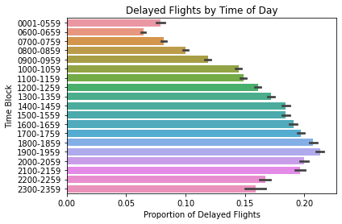

# Final Project 
Joseph Kerkhof

DS 740

Spring 2020

# Report Summary

In the contents of this report, I will discuss my methods of Machine Learning discovery for how to predict flight departure delays by 15 minutes or more. The data used in this report is issued via the U.S. Government under U.S. Govt. Works and distributed on [kaggle](https://www.kaggle.com/divyansh22/flight-delay-prediction). The data in this set contains flight data for the months January 2019 and January 2020.

I will be trying to predict the binary output of the variable `DEP_DEL15` which is a record of flight delays by 15 or more minutes.

Given that this data is captured in the month of January 2019 and January 2020, it's reasonable to expect that this model may only accurately predict flights in January into the future. In addition, because I want to predict if a flight will be delayed by 15 or more minutes before takeoff, I will not be using data that is captured after the takeoff happens. As an example, we can't use information if a flight arrives late by 15 or more minutes, or if the flight was diverted.

# Audience

The usefulness of this model is to help prevent flight delays and improve customer experience. US airlines are the intended audience and user of these models.

# Methods

I will be using two different methods to try and predict the value of `DEP_DEL15`. For the first method, I'll be using logistic regression in R and for the second, I'll be using Neural Networks in Python 3 using Tensorflow.

### Methods Note

Because the data for this project is large (~148MB), and R operates on a single thread, I'll need to only use a fraction of the data compared to what Python/Tensorflow can handle. In my analysis, I was only able to use 1/40th the amount of data in R compared to the data used in Python.

# Important Variables

In the data exploration, I noticed that there was a strong relationship to the time of day and the frequency of the delays.

It seems that flights are less likely to be delayed in the morning and more likely to be delayed into the afternoon and peaking in the early evening. Because flights in the afternoon are using airplanes that have already flown once or twice earlier in the day, this graph makes sense. The risk of a flight delay increases with each previous flight during the day. This variable is very important and must be included in the model to improve accuracy.

# Results

Using Python/Tensorflow, I was able to use a Neural Network that predicted if a flight was delayed ~84% of the time. With R, I was reporting an accuracy of ~96% with logistic regression.

This analysis could likely be improved if we had access to data around maintenance crew on the flight operations line. It would be helpful to have metrics around the average time it takes for a maintenance issue to be resolved.